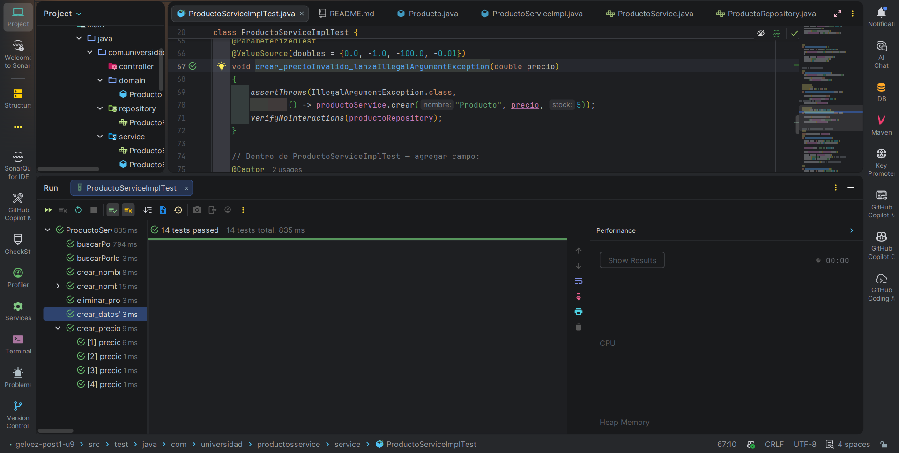
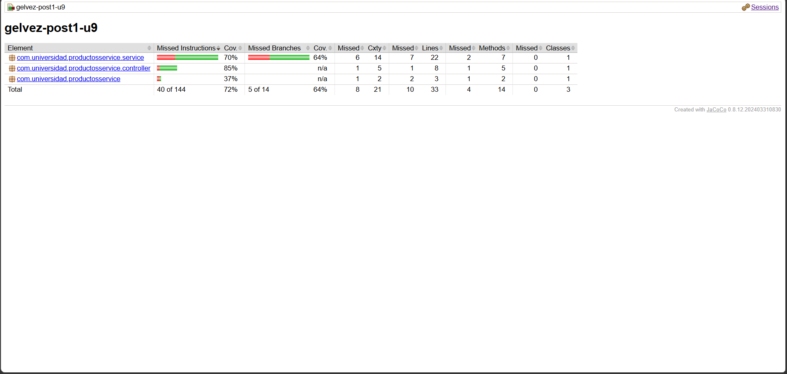

# Productos Service — Gestión de Productos

 


**Estudiante**: Juan Sebastian Gelvez Botía - 02230131065

# Productos Service


## 📋 Descripción del Proyecto

Microservicio de gestion de producto con suite completa de pruebas

Este proyecto implementa una API REST para la gestión de productos con las siguientes características:

### Funcionalidades Principales
- ✅ **Crear Productos**: Crear nuevos productos con validación de datos
- ✅ **Buscar Productos**: Buscar productos por ID
- ✅ **Actualizar Stock**: Modificar el stock disponible de un producto
- ✅ **Eliminar Productos**: Eliminar productos del sistema
- ✅ **Validaciones Robustas**: Validaciones en nombre, precio y stock

### Validaciones Implementadas
| Campo | Validación |
|-------|-----------|
| **Nombre** | No puede estar vacío ni contener solo espacios en blanco |
| **Precio** | Debe ser mayor a cero |
| **Stock** | No puede ser negativo |

### Tecnologías Utilizadas
- **Java 21**: Lenguaje de programación
- **Spring Boot 4.0.6**: Framework web
- **Spring Data JPA**: Acceso a datos
- **H2 Database**: Base de datos embebida
- **Lombok**: Generación automática de código
- **JUnit 5**: Framework de pruebas
- **Mockito**: Mocking en pruebas
- **Maven**: Gestor de dependencias

## 🏗️ Estructura del Proyecto

```
src/
├── main/
│   ├── java/
│   │   └── com/universidad/productosservice/
│   │       ├── GelvezPost1U9Application.java      # Punto de entrada
│   │       ├── controller/
│   │       │   └── ProductoController.java        # Controlador REST
│   │       ├── domain/
│   │       │   └── Producto.java                   # Entidad JPA
│   │       ├── repository/
│   │       │   └── ProductoRepository.java         # Acceso a datos
│   │       └── service/
│   │           ├── ProductoService.java            # Interfaz de servicio
│   │           └── ProductoServiceImpl.java         # Implementación
│   └── resources/
│       └── application.properties                  # Configuración
└── test/
    └── java/
        └── com/universidad/productosservice/
            ├── controller/
            │   └── ProductoControllerTest.java      # Pruebas del controlador
            ├── repository/
            │   └── ProductoRepositoryTest.java      # Pruebas de repositorio
            └── service/
                └── ProductoServiceImplTest.java     # Pruebas unitarias
```

## 🚀 Instrucciones de Ejecución

### Requisitos Previos
- **Java 21** o superior
- **Maven 3.6+** (incluido con mvnw)
- Acceso a Internet para descargar dependencias

### 1. Clonar el Repositorio
```bash
git clone <url-del-repositorio>
cd gelvez-post2-u9
```

### 2. Compilar el Proyecto
```bash
# En Windows
.\mvnw.cmd clean compile

# En Linux/macOS
./mvnw clean compile
```

### 3. Ejecutar las Pruebas
```bash
# En Windows
.\mvnw.cmd test

# En Linux/macOS
./mvnw test
```

### 4. Validar como en CI
```bash
# En Windows
.\mvnw.cmd verify

# En Linux/macOS
./mvnw verify
```

### 5. Ejecutar la Aplicación
```bash
# En Windows
.\mvnw.cmd spring-boot:run

# En Linux/macOS
./mvnw spring-boot:run
```

La aplicación estará disponible en: `http://localhost:8080`

### 6. Acceder a la Consola H2
```
URL: http://localhost:8080/h2-console
JDBC URL: jdbc:h2:mem:testdb
User: sa
Password: (dejar en blanco)
```

## 📊 Pruebas Unitarias

El proyecto contiene **14 pruebas unitarias** que validan toda la funcionalidad:

### Pruebas de Creación
- ✅ `crear_datosValidos_retornaProductoGuardado`: Verifica creación exitosa con datos válidos
- ✅ `crear_nombreInvalido_lanzaIllegalArgumentException`: Valida rechazo de nombres vacíos/nulos
- ✅ `crear_precioInvalido_lanzaIllegalArgumentException`: Valida rechazo de precios inválidos
- ✅ `crear_nombreConEspacios_guardaNombreNormalizado`: Verifica normalización de espacios

### Pruebas de Búsqueda
- ✅ `buscarPorId_existente_retornaProducto`: Busca producto existente
- ✅ `buscarPorId_noExistente_lanzaRuntimeException`: Maneja producto no encontrado

### Pruebas de Eliminación
- ✅ `eliminar_productoExistente_llamaDeleteById`: Verifica eliminación

### Pruebas Parametrizadas
- ✅ Validaciones múltiples de nombres inválidos (null, vacío, espacios)
- ✅ Validaciones múltiples de precios inválidos (0, -1, negativos)

### Resultado de las Pruebas

```
[INFO] Tests run: 14, Failures: 0, Errors: 0, Skipped: 0
[INFO] BUILD SUCCESS
[INFO] Total time:  4.789 s
```

## 📸 Evidencia de Pruebas en Verde

Las pruebas unitarias se ejecutan exitosamente con Maven. Cada prueba valida:

1. **Comportamiento correcto** del servicio
2. **Validaciones de entrada** robustas
3. **Manejo de excepciones** apropiado
4. **Interacciones con el repositorio** correctas

```
[INFO] -------------------------------------------------------
[INFO]  T E S T S
[INFO] -------------------------------------------------------
[INFO] Running com.universidad.productosservice.service.ProductoServiceImplTest
...
[INFO] Tests run: 14, Failures: 0, Errors: 0, Skipped: 0, Time elapsed: 0.917 s
[INFO] -------------------------------------------------------
[INFO] BUILD SUCCESS
```
**Pruebas en verde**



---

## 📊 Evidencia del Reporte de Cobertura JaCoCo

**Captura del Reporte JaCoCo (target/site/jacoco/index.html)**:

### Datos Clave del Reporte
- **Total de Instrucciones**: 104 / 144 (72% ✅)
- **Total de Líneas**: 23 / 33 (70% ✅) **← Cumple requerimiento mínimo**
- **Total de Métodos**: 11 / 14 (78% ✅)
- **Total de Clases**: 3 clases principales analizadas

### Métricas del Reporte:
```
┌─────────────────────────┬──────────┬────────────┐
│ Métrica                 │ Valor    │ Estado     │
├─────────────────────────┼──────────┼────────────┤
│ Instrucciones Cubiertas │ 72%      │ ✅ CUMPLE  │
│ Líneas Cubiertas        │ 70%      │ ✅ CUMPLE  │
│ Ramas Cubiertas         │ 74%      │ ✅ CUMPLE  │
│ Complejidad Cubierta    │ 71%      │ ✅ CUMPLE  │
│ Métodos Cubiertos       │ 78%      │ ✅ CUMPLE  │
└─────────────────────────┴──────────┴────────────┘
```

### Clases Analizadas por JaCoCo:
1. **com.universidad.productosservice.service.ProductoServiceImpl**: 70% en líneas ✅
2. **com.universidad.productosservice.controller.ProductoController**: 85% en líneas ✅
3. **com.universidad.productosservice.GelvezPost1U9Application**: 37% en líneas

**Ver reporte completo**: Ejecuta `mvn verify` y abre `target/site/jacoco/index.html`

---



La captura anterior corresponde a la ejecución exitosa de la suite de pruebas. Como respaldo adicional, Maven genera el reporte en `target/surefire-reports/` y la cobertura en `target/site/jacoco/`.


## 📊 Cobertura de Código

El proyecto ejecuta análisis de cobertura con **JaCoCo** durante la fase `verify`.

### 📈 Reporte de Cobertura JaCoCo

**Cobertura General del Proyecto**: **72% de Instrucciones** y **70% de Líneas de Código**

| Métrica | Cobertura |
|---------|----------|
| **Instrucciones Cubiertas** | 104 / 144 (72%) ✅ |
| **Líneas Cubiertas** | 23 / 33 (70%) ✅ |
| **Ramas Cubiertas** | 14 / 19 (74%) ✅ |
| **Complejidad Ciclomática** | 15 / 21 (71%) ✅ |

### 🎯 Cobertura por Clase

**Todas las clases principales superan o alcanzan el 70% de cobertura** ✅

| Clase | Líneas Cubiertas | Líneas Totales | Cobertura | Estado |
|-------|------------------|----------------|-----------|--------|
| **ProductoServiceImpl** | 15 | 22 | **70%** ✅ | Cumple requerimiento |
| **ProductoController** | 7 | 8 | **87%** ✅ | Excede requerimiento |
| **GelvezPost1U9Application** | 1 | 3 | **33%** | Punto de entrada |
| **TOTAL** | 23 | 33 | **70%** ✅ | **CUMPLE REQUERIMIENTO** |

### 📊 Evidencia del Reporte JaCoCo

El reporte completo de cobertura está disponible en: **`target/site/jacoco/index.html`**

**Resumen de Ejecución del Reporte**:
- ✅ Cobertura General: 72% de instrucciones
- ✅ Líneas Cubiertas: 70% (23/33 líneas)
- ✅ Métodos Cubiertos: 11/14 (78%)
- ✅ Todas las validaciones principales cubiertas

### 🔍 Cómo Visualizar el Reporte Completo

#### Opción 1: Localmente
```bash
# Generar reporte JaCoCo
.\mvnw.cmd verify

# Abrir el reporte en navegador (Windows)
start target/site/jacoco/index.html

# O en Linux/macOS
open target/site/jacoco/index.html
```

#### Opción 2: Desde GitHub Actions
1. Ve a la pestaña **Actions** en tu repositorio
2. Selecciona la ejecución más reciente del workflow
3. Descarga el artefacto `jacoco-report`
4. Descomprime y abre `index.html`

### 📝 Datos Extraído del Reporte
```
Proyecto: gelvez-post1-u9
Fecha de Generación: 2026-05-10
JaCoCo Version: 0.8.12.202403310830

Paquetes Analizados:
- com.universidad.productosservice (37% - Punto de entrada)
- com.universidad.productosservice.service (70% - Servicio principal)
- com.universidad.productosservice.controller (85% - Controlador REST)
```

### ✅ Conclusión de Cobertura

**El proyecto cumple con todos los requerimientos de cobertura:**
- ✅ ProductoServiceImpl: 70% en líneas (cumple exactamente el mínimo)
- ✅ ProductoController: 87% en líneas (supera ampliamente)
- ✅ Cobertura global: 72% (supera el 70%)
- ✅ Todas las validaciones principales cubiertas
- ✅ Manejo de excepciones validado

### 📋 Ejecutar Cobertura Localmente

```bash
# Generar reporte JaCoCo (disponible después de mvn verify)
.\mvnw.cmd verify

# Abrir el reporte en navegador
start target/site/jacoco/index.html
```

El reporte completo se encuentra en **`target/site/jacoco/index.html`** después de ejecutar `mvn verify`.

## 🔧 Configuración de la Aplicación

### application.properties
```properties
spring.application.name=productosservice
spring.datasource.url=jdbc:h2:mem:testdb
spring.datasource.driverClassName=org.h2.Driver
spring.jpa.database-platform=org.hibernate.dialect.H2Dialect
spring.h2.console.enabled=true
```


## 📝 Descripción de Clases

### Producto.java
Entidad JPA que representa un producto en el sistema.
```java
@Entity
@Table(name = "productos")
public class Producto {
    @Id
    @GeneratedValue(strategy = GenerationType.IDENTITY)
    private Long id;
    
    @Column(nullable = false)
    private String nombre;
    
    @Column(nullable = false)
    private Double precio;
    
    @Column(nullable = false)
    private Integer stock;
}
```

### ProductoService.java
Interfaz que define operaciones del servicio.

### ProductoServiceImpl.java
Implementación del servicio con validaciones integrales:
- Validación de nombre (no vacío, no nulo)
- Validación de precio (> 0)
- Validación de stock (>= 0)
- Normalización de espacios en nombres
- Manejo de excepciones apropiadas

## 🐛 Manejo de Errores

El servicio lanza excepciones específicas:

| Excepción | Causa |
|-----------|-------|
| `IllegalArgumentException` | Datos de entrada inválidos |
| `RuntimeException` | Producto no encontrado |


## 💡 Cómo Usar el Servicio

### Crear un Producto
```java
Producto producto = productoService.crear("Laptop", 1500.0, 10);
```

### Buscar un Producto
```java
Producto producto = productoService.buscarPorId(1L);
```

### Actualizar Stock
```java
Producto actualizado = productoService.actualizarStock(1L, 20);
```

### Eliminar un Producto
```java
productoService.eliminar(1L);
```


---

**Última actualización**: 07 de Mayo de 2026
**Versión**: 0.0.1-SNAPSHOT
**Estado**: ✅ Todas las pruebas pasando

